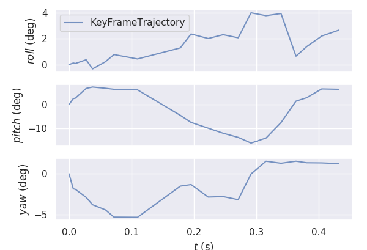
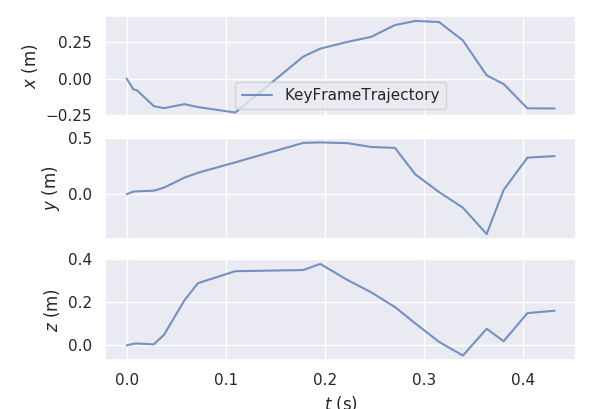
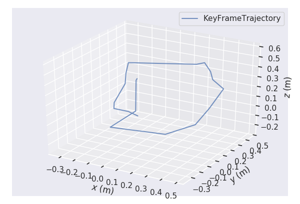

### 1. Take videos

我們使用獅子王影片（因為最近迷上這部），**請點擊下方圖 或 文字連結**

[影片連結1](http://youtu.be/vt5fpE0bzSY)

### 2. Make these visual effects with ORB-SLAM2 and using post-production software(photoshop）+ Zoom In/Out + Rotation

**請點擊下方圖或文字連結** 
[影片連結2](https://youtu.be/eDuFB6KNpdQ)

**原本作者的結果** 
 

### 3.Insert a 3D model to video

[a.影片連結3 + 愛跳舞的香蕉](https://youtu.be/kLqD6h6V5sE) 
[b.影片連結4 + 頑皮的小男孩想偷喝飲料](https://youtu.be/LTan41PkaXw) 
[c.影片連結5 + 骷髏頭Dancing](https://youtu.be/DssZGkik3Eg) 
[d.影片連結6 + 霸王龍模型](https://youtu.be/6i3Z6LCjQsU) 

**原本作者的結果** 

### 5.other SLAM methods

我們試著使用LSD-SLAM，並加入3D model圖形 **（豬的3D模型）**，但是我的顯卡太舊（750M），不太不夠力（卡卡的），規劃換成GTX1080顯卡，我們將其延伸我們**final Project**。

[影片連結7 + 3D豬模型 + LSD-SLAM 演算法](https://youtu.be/j-bfGB9vl4I) 

### 6.使用Python繪出維度與路徑（獅子王影片的維度）

#### a. Roll/pitch/yaw圖形

#### b. X/Y/Z圖形

#### c. 3D_Trajectory圖形

### 7.參考文獻

[1.ORB_SLAM2教學步驟](https://github.com/cvfx-2019/homework6-Match-Moving-SLAM) 
[2.Rtabmap1](http://introlab.github.io/rtabmap/) 
[3.Rtabmap Github](https://github.com/introlab/rtabmap/) 
[4.LSD-SLAM: Large-Scale Direct Monocular SLAM](https://vision.in.tum.de/research/vslam/lsdslam?redirect=1) 

